<h1 align="center"> ROCKET TATTOO ESTUDIO</h1>
​
​

Proyecto 5 - Web estudio de tatuajes- Semana 9-10

​

Proyecto de creacion de la web tanto en fronted y backend.
 
Desarrollada como formacion del Bootcamp de Full Stack Developer de Geekshubs Academy.

​
​

​
​
<h5 align="center"> Tecnologías utilizadas</h1>
​

JavaScript, HTML5, CSS3, Bootstrap, GIT y GitHUB

  <tr >
    <td valign="top"></td>
    <td valign="top"></td>
    <td valign="top"></td>
    <td></td>
     <td valign="top"></td>
      <td valign="top"></td>
      <td valign="top"></td>
      <td valign="top"></td>
      <td valign="top"></td>
  
  

## Tabla de contenidos

​

- [👩🏻‍💻 Descripción del proyecto]
- [🔍 Observaciones]
- [⚖️ Licencia y Copyright]
- [📚Instrucciones]
  ​
  ​

### Instrucciones
1. Clona este repositorio en tu máquina local usando el siguiente comando: `git clone [URL del repositorio]`.

2. Clona el reposito proj-sql-bd-tatto-studio, estudio de tatuajes backend, en tu máquina local usando el siguiente comando: `git clone [URL del repositorio]`.

3. Ejecuta el comando `npm run dev` en la consola del proyecto 4, estudio de tatuajes backend, para levantar el servidor backend.

4. Ejecuta el comando `npm run dev` en la consola de este proyecto para levantar el servidor frontend.

5. Disfruta de una página web completamente funcional, registrate, crea citas y explora el rico mundo del arte de los tatuajes.

### Descripción

​
Quinto proyecto creado durante la semana 9 y 10 del bootcamp, consiste en una web completamente funcional de un estudio de tatuajes. Tanto a nivel de frontend como de backend.

Consta de las siguientes funcionalidades.

Registro de usuarios.

Login y LogOut de usuarios.

Creacion - Anulacion y modificacion de citas.

Panel de usuario, de tatuador y de admin.

Galeria de Tattoos.

Galeria de Artistas.

Diferentes vistas de informacion del estudio.

Consulta a BBDD

DatePicker.

Conexion a Redes sociales.

## Aqui las diferentes vistas del juego:

###### Menu principal:

Vista principal del estudio
Aqui puedes ver toda la pagina en general, con sus diferentes secciones

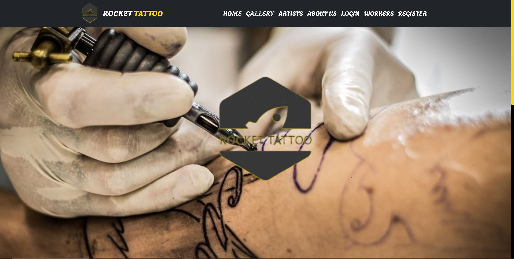
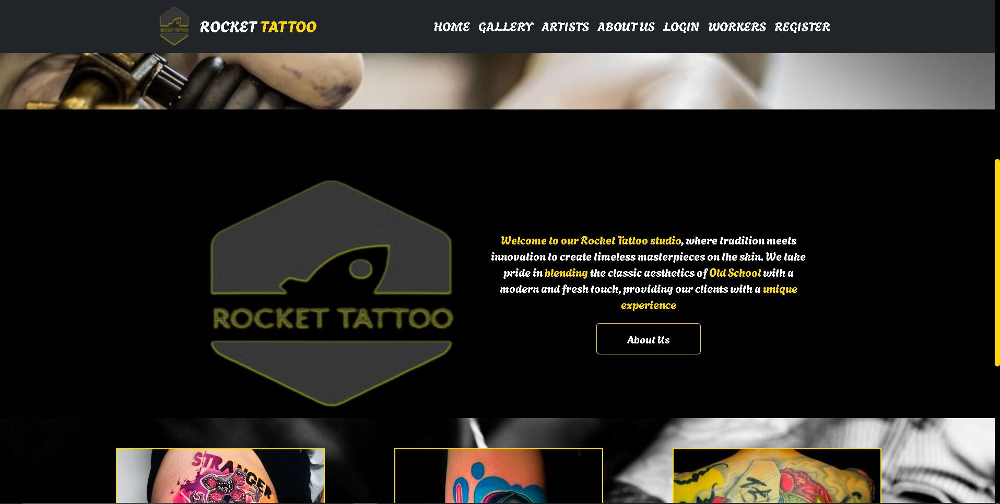
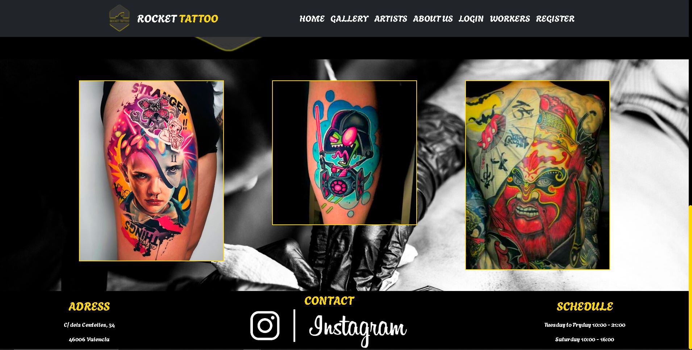

###### About US

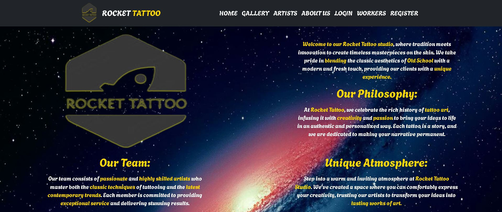
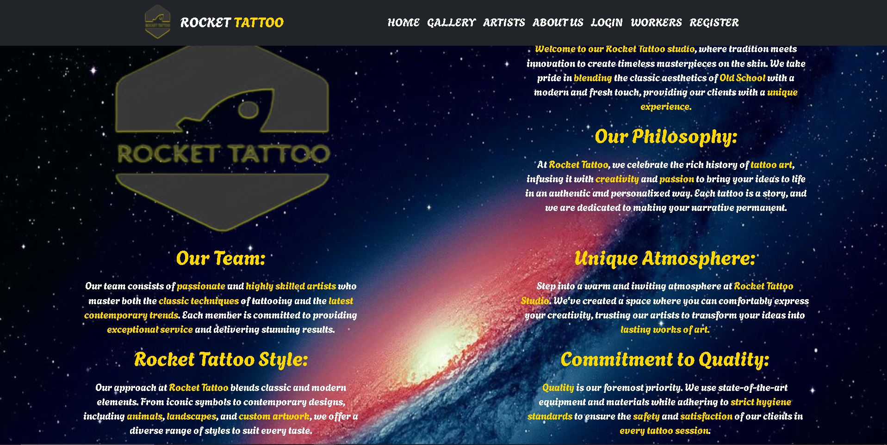

###### Artists

Vista de los tatuadores, con una breve descripcion, un bonito hover y si haces click en ellos se abre su presentacion.

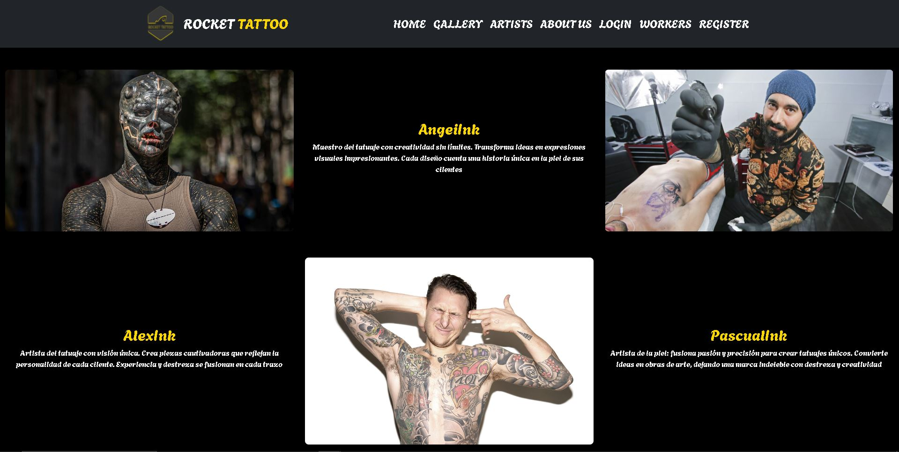

###### Gallery

Galeria de tattoos

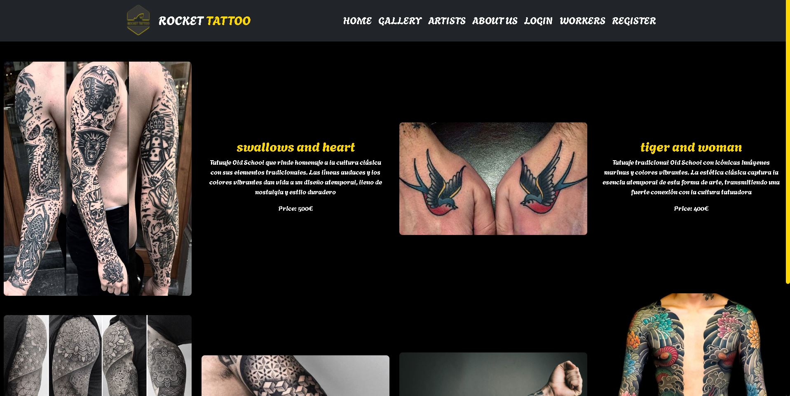
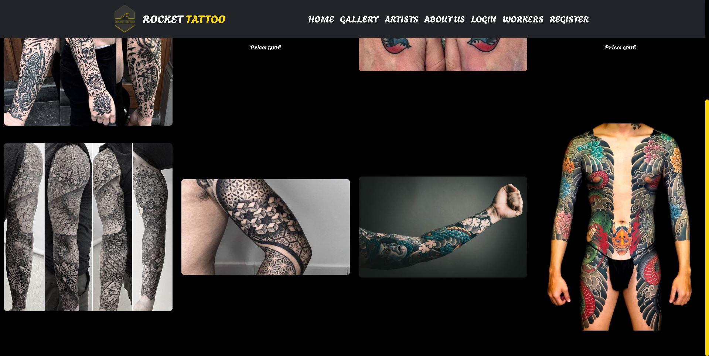

###### Login

Vista del Login

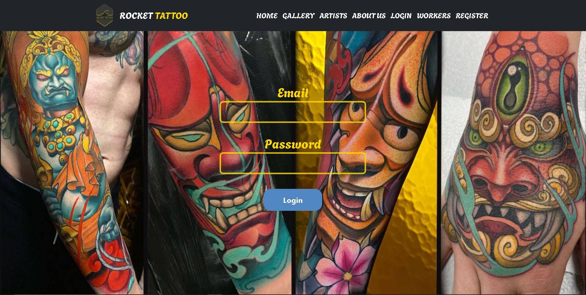

###### Workers

Vista de Workers

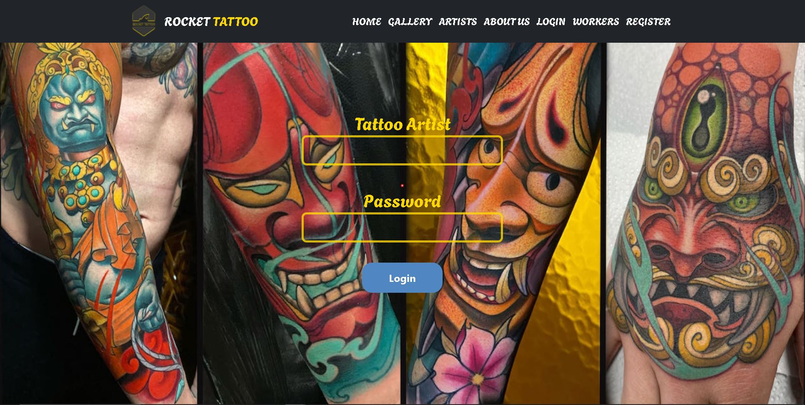

###### Register

Vista del Register

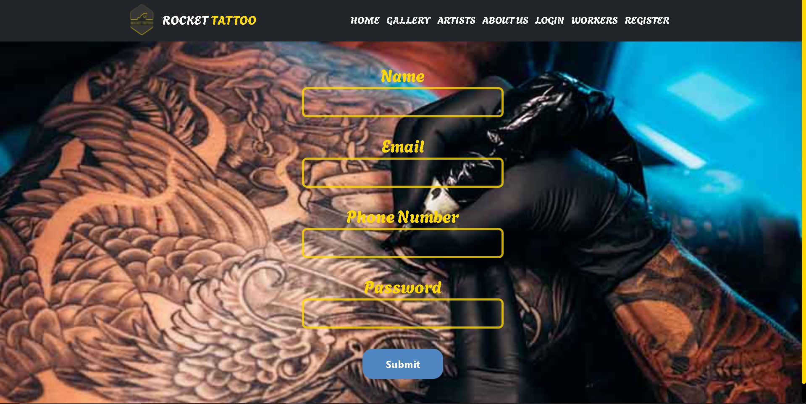

###### Panel de usuario

Vista del panel de usuario

Vista pestaña Appointments

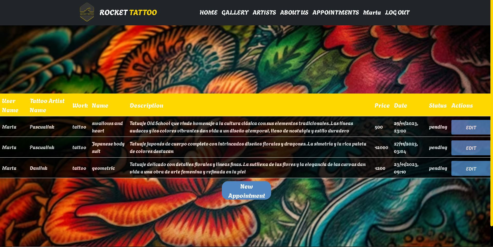

Vista de edicion dentro de Appointments

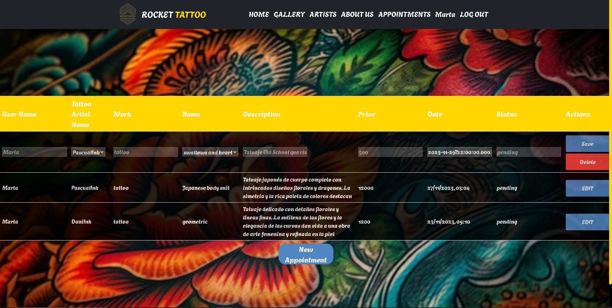

Vista New Appointment

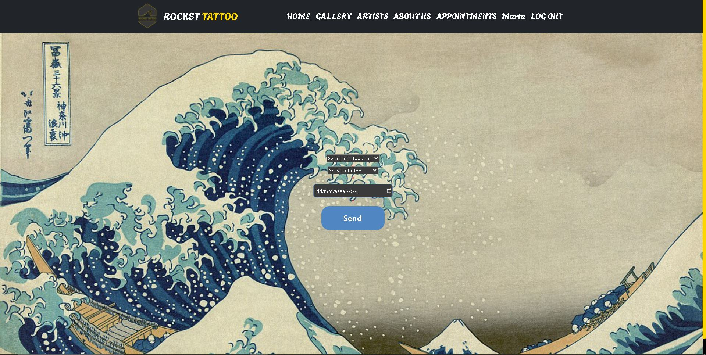

Vista Perfil

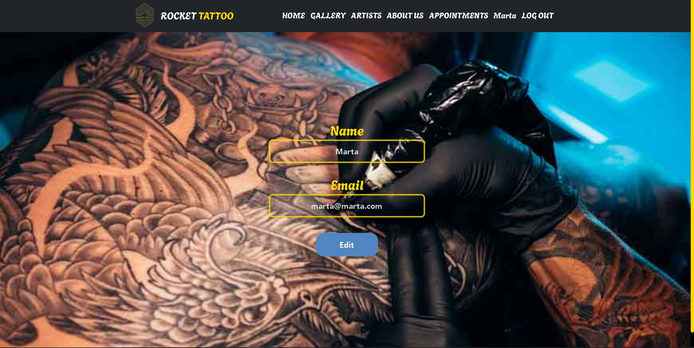

###### Panel de admin

Vista del panel de admin

Vista Profile de Admin

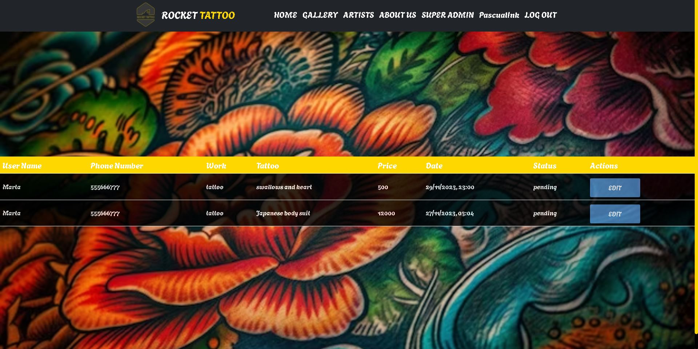

Vista Edit Appointments Profile

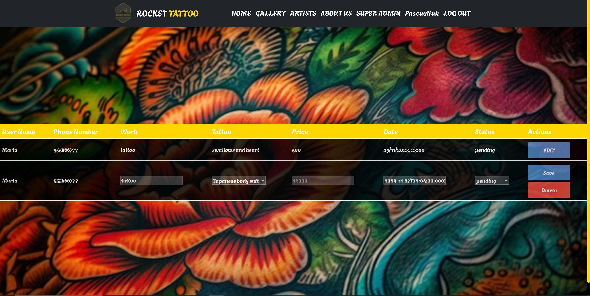

###### Info a pie de pagina

Dirrecion del estudio, redes sociales y horarios.

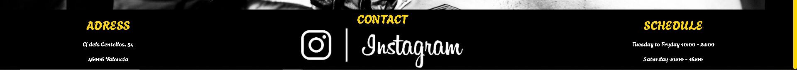

### Observaciones

- ��Ha sido un trabajo durisimo, aun con todas las ayudas al alcance, Stack overflow, youtube...han sido dos semanas de dedicacion plena a estudiar React y de esos dias 10 para realizar el proyecto, al menos espero que os guste :).  

- ��Todo el codigo ha sido creado en em's.
- ��Necesito mas tiempo para asimilar muchos trozos de codigo bien, mucho codigo copiapega de tutoriales de youtube/stackoverflow.

 

### Cambios pendientes

- ��Mejorar el responsive.
- ��Mejorar la edicion de campos con mas opciones.
- ��Pulir los estilos porque hay muchos repetidos y que no se aplican.
- ��Volver a repasar el backend para mejorar las API calls y la obtencion de datos.
- ��Añadir funcionalidad para que se puede modificar y eliminar las citas de un tatuador, y con el role super admin lo mismo.

### Agradecimientos

A toda esos heroes anonimos que suben trocitos de codigo a internet y hace la vida mucho mas facil a los estudintes.
​
​

### Licencia y copyright

📝 La licencia utilizada es una MIT License.
Este proyecto ha sido realizado pixel a pixel por mi, para completar la segunda semana del BootCamp Full Stack de GeeksHubs Academy Valencia.
